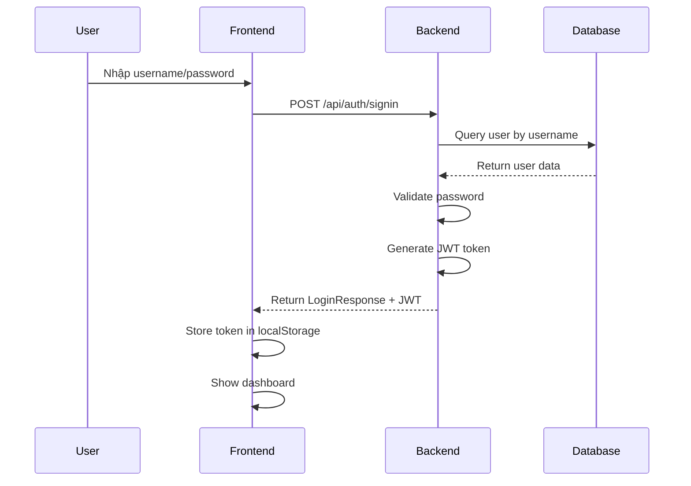
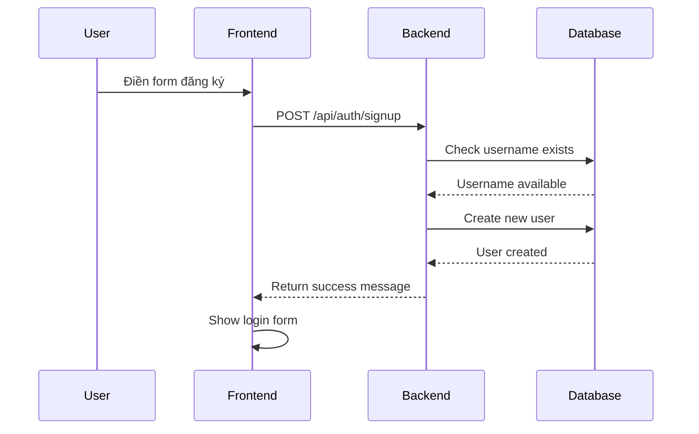

# 🎓 MathBridge - Comprehensive Math Tutoring Platform Demo

## 📖 Tổng quan Project

**MathBridge** là một hệ thống quản lý và kết nối dạy kèm Toán học cho học sinh THPT trường quốc tế. Đây là một **demo project hoàn chỉnh** thể hiện kiến trúc **Full-Stack Web Application** với **Frontend** và **Backend** tách biệt.

### 🎯 Mục tiêu Demo
- **Giáo viên**: Hiểu cách xây dựng web application với Spring Boot + Frontend
- **Sinh viên**: Học cách kết nối Frontend và Backend qua REST API
- **Thực tế**: Áp dụng kiến trúc microservices và modern web development

---

## 🏗️ Kiến trúc Tổng thể

```
┌─────────────────────────────────────────────────────────────┐
│                    MATHBRIDGE SYSTEM                        │
├─────────────────────────────────────────────────────────────┤
│  🌐 FRONTEND (Port 8000)    │    🚀 BACKEND (Port 8080)    │
│  ┌─────────────────────────┐ │  ┌─────────────────────────┐  │
│  │ • HTML/CSS/JavaScript   │ │  │ • Spring Boot Framework │  │
│  │ • User Interface        │ │  │ • REST API Controllers  │  │
│  │ • Form Handling         │ │  │ • Business Logic        │  │
│  │ • API Communication     │ │  │ • Security (JWT)        │  │
│  │ • State Management      │ │  │ • Data Validation       │  │
│  └─────────────────────────┘ │  └─────────────────────────┘  │
│              │ HTTP Requests │              │                │
│              │ JSON Response │              │                │
│              ▼               │              ▼                │
│  ┌─────────────────────────┐ │  ┌─────────────────────────┐  │
│  │ • Local Storage         │ │  │ • H2 In-Memory Database │  │
│  │ • Session Management    │ │  │ • JPA Entities          │  │
│  │ • Error Handling        │ │  │ • Repository Pattern    │  │
│  └─────────────────────────┘ │  └─────────────────────────┘  │
└─────────────────────────────────────────────────────────────┘
```

### 🔄 Luồng hoạt động chính:
1. **User** tương tác với **Frontend** (HTML/CSS/JS)
2. **Frontend** gửi **HTTP requests** đến **Backend** (Spring Boot)
3. **Backend** xử lý logic, truy vấn **Database** (H2)
4. **Backend** trả về **JSON response** cho Frontend
5. **Frontend** cập nhật UI dựa trên response

---

## 📁 Cấu trúc Project Chi tiết

```
MathBridge-Demo-Complete/
├── 📂 mathbridge-backend/              # Spring Boot Backend
│   ├── 📄 pom.xml                     # Maven Dependencies
│   ├── 📂 src/main/java/com/mathbridge/
│   │   ├── 🚀 MathBridgeApplication.java    # Entry Point
│   │   ├── 📂 controller/              # REST API Controllers
│   │   │   └── AuthController.java     # Authentication APIs
│   │   ├── 📂 entity/                  # JPA Database Entities
│   │   │   ├── User.java              # User Entity
│   │   │   ├── Student.java           # Student Entity
│   │   │   ├── Tutor.java             # Tutor Entity
│   │   │   └── UserRole.java          # Role Enum
│   │   ├── 📂 repository/              # Data Access Layer
│   │   │   └── UserRepository.java    # User Repository
│   │   ├── 📂 service/                 # Business Logic Layer
│   │   │   ├── UserDetailsServiceImpl.java
│   │   │   └── UserPrincipal.java
│   │   ├── 📂 security/                # Security Components
│   │   │   ├── JwtUtils.java          # JWT Token Management
│   │   │   ├── AuthTokenFilter.java   # JWT Filter
│   │   │   └── AuthEntryPointJwt.java # Error Handler
│   │   ├── 📂 config/                  # Configuration Classes
│   │   │   ├── WebSecurityConfig.java # Security Config
│   │   │   └── DataLoader.java        # Demo Data Loader
│   │   └── 📂 dto/                     # Data Transfer Objects
│   │       ├── LoginRequest.java      # Login DTO
│   │       ├── LoginResponse.java     # Login Response DTO
│   │       ├── SignupRequest.java     # Signup DTO
│   │       └── ApiResponse.java       # Generic API Response
│   ├── 📂 src/main/resources/
│   │   └── 📄 application.properties  # App Configuration
│   └── 📂 target/                      # Maven Build Output
├── 📂 mathbridge-frontend/             # HTML/CSS/JS Frontend
│   ├── 📄 index.html                  # Main HTML Page
│   ├── 📄 styles.css                  # CSS Styling
│   └── 📄 script.js                   # JavaScript Logic
├── 📄 run-all.bat                     # Windows Batch Script
├── 📄 run-backend.bat                 # Backend Runner
├── 📄 run-frontend.bat                # Frontend Runner
└── 📄 README.md                       # This File
```

---

## 🛠️ Công nghệ sử dụng

### 🚀 Backend Technologies
| Technology | Version | Mục đích |
|------------|---------|----------|
| **Java** | 17+ | Programming Language |
| **Spring Boot** | 3.2.0 | Main Framework |
| **Spring Security** | 6.2.0 | Authentication & Authorization |
| **Spring Data JPA** | 3.2.0 | Database ORM |
| **H2 Database** | 2.2.224 | In-Memory Database |
| **JWT (jjwt)** | 0.12.3 | Token-based Authentication |
| **Maven** | 3.6+ | Build Tool & Dependency Management |
| **Jakarta Validation** | 3.0.2 | Data Validation |

### 🌐 Frontend Technologies
| Technology | Mục đích |
|------------|----------|
| **HTML5** | Structure & Semantic Markup |
| **CSS3** | Styling & Responsive Design |
| **JavaScript (ES6+)** | Client-side Logic & API Communication |
| **Fetch API** | HTTP Requests to Backend |
| **Local Storage** | Session Management |
| **Font Awesome** | Icons & UI Elements |

---

## 🚀 Hướng dẫn Chạy Project

### ⚡ Cách 1: Chạy nhanh (Khuyến nghị)
```bash
# Mở Command Prompt/PowerShell
cd C:\Users\trinh\MathBridge-Demo-Complete

# Chạy cả Frontend và Backend
run-all.bat
```

### 🔧 Cách 2: Chạy thủ công

#### Bước 1: Chạy Backend
```bash
# Terminal 1 - Backend
cd mathbridge-backend
mvn spring-boot:run
```

#### Bước 2: Chạy Frontend
```bash
# Terminal 2 - Frontend
cd mathbridge-frontend
python -m http.server 8000
```

### 💻 Cách 3: Chạy trong IntelliJ IDEA
1. **Mở project**: File → Open → chọn `mathbridge-backend`
2. **Chạy Backend**: Right-click `MathBridgeApplication.java` → Run
3. **Chạy Frontend**: Mở `mathbridge-frontend/index.html` trong browser

---

## 🔍 Kiểm tra Hệ thống

### ✅ Backend Status
Khi backend chạy thành công, bạn sẽ thấy:
```
Started MathBridgeApplication in X.XXX seconds (JVM running for X.XXX)
Tomcat started on port 8080 (http) with context path ''
H2 console available at '/h2-console'
```

**API Endpoints:**
- `GET http://localhost:8080/api/auth/test` - Test API connection
- `POST http://localhost:8080/api/auth/signin` - User login
- `POST http://localhost:8080/api/auth/signup` - User registration

**H2 Database Console:**
- URL: `http://localhost:8080/h2-console`
- JDBC URL: `jdbc:h2:mem:testdb`
- Username: `sa`
- Password: `password`

### ✅ Frontend Status
Mở browser và truy cập: `http://localhost:8000`

**Giao diện sẽ hiển thị:**
- 🏠 **Home Page**: Giới thiệu về MathBridge
- 🔐 **Login Form**: Đăng nhập với demo accounts
- 📝 **Register Form**: Đăng ký tài khoản mới
- 📊 **Dashboard**: Thông tin user sau khi đăng nhập

---

## 👥 Demo Accounts

Hệ thống đã tạo sẵn 3 tài khoản demo:

| Role | Username | Password | Mô tả |
|------|----------|----------|-------|
| **Admin** | `admin` | `admin123` | Quản trị viên hệ thống |
| **Student** | `student1` | `student123` | Học sinh sử dụng dịch vụ |
| **Tutor** | `tutor1` | `tutor123` | Gia sư cung cấp dịch vụ |

---

## 🔄 Luồng hoạt động chi tiết

### 🔐 Login Flow


### 📝 Registration Flow


---

## 🎯 Tính năng Demo

### ✅ Authentication & Authorization
- **JWT Token-based Authentication**: Bảo mật cao, stateless
- **Role-based Access Control**: STUDENT, TUTOR, ADMIN
- **Session Management**: Tự động đăng nhập khi refresh
- **Password Encryption**: BCrypt hashing

### ✅ User Management
- **User Registration**: Đăng ký tài khoản mới
- **User Login**: Đăng nhập với validation
- **Profile Management**: Xem thông tin user
- **Role Assignment**: Phân quyền theo vai trò

### ✅ Database Operations
- **JPA Entities**: User, Student, Tutor với relationships
- **Repository Pattern**: Data access abstraction
- **Auto Schema Creation**: Tự động tạo tables
- **Demo Data Loading**: Tự động tạo demo accounts

### ✅ API Design
- **RESTful APIs**: Chuẩn REST architecture
- **JSON Communication**: Data exchange format
- **Error Handling**: Comprehensive error responses
- **CORS Support**: Cross-origin requests

---

## 📊 API Documentation

### 🔐 Authentication Endpoints

#### POST /api/auth/signin
**Mục đích**: Đăng nhập user vào hệ thống

**Request Body:**
```json
{
    "username": "admin",
    "password": "admin123"
}
```

**Response (Success):**
```json
{
    "token": "eyJhbGciOiJIUzI1NiIsInR5cCI6IkpXVCJ9...",
    "type": "Bearer",
    "id": 1,
    "username": "admin",
    "email": "admin@mathbridge.com",
    "role": "ADMIN"
}
```

**Response (Error):**
```json
{
    "success": false,
    "message": "Invalid username or password"
}
```

#### POST /api/auth/signup
**Mục đích**: Đăng ký user mới

**Request Body:**
```json
{
    "username": "newuser",
    "email": "user@example.com",
    "password": "password123",
    "firstName": "John",
    "lastName": "Doe",
    "phoneNumber": "0123456789",
    "role": "STUDENT"
}
```

**Response:**
```json
{
    "success": true,
    "message": "User registered successfully!"
}
```

#### GET /api/auth/test
**Mục đích**: Test API connection

**Response:**
```
API is working!
```

---

## 🏗️ Kiến trúc Code Backend

### 📦 Package Structure
```
com.mathbridge/
├── 🚀 MathBridgeApplication.java      # Spring Boot Entry Point
├── 📂 controller/                     # Presentation Layer
│   └── AuthController.java           # REST API Endpoints
├── 📂 service/                        # Business Logic Layer
│   ├── UserDetailsServiceImpl.java   # User Details Service
│   └── UserPrincipal.java            # Spring Security User
├── 📂 repository/                     # Data Access Layer
│   └── UserRepository.java           # User Data Repository
├── 📂 entity/                         # Database Models
│   ├── User.java                     # User Entity
│   ├── Student.java                  # Student Entity
│   ├── Tutor.java                    # Tutor Entity
│   └── UserRole.java                 # Role Enum
├── 📂 security/                       # Security Layer
│   ├── JwtUtils.java                 # JWT Token Utils
│   ├── AuthTokenFilter.java          # JWT Filter
│   └── AuthEntryPointJwt.java        # Auth Error Handler
├── 📂 config/                         # Configuration
│   ├── WebSecurityConfig.java        # Security Configuration
│   └── DataLoader.java               # Demo Data Loader
└── 📂 dto/                           # Data Transfer Objects
    ├── LoginRequest.java             # Login Request DTO
    ├── LoginResponse.java            # Login Response DTO
    ├── SignupRequest.java            # Signup Request DTO
    └── ApiResponse.java              # Generic Response DTO
```

### 🔄 Data Flow
```
HTTP Request → Controller → Service → Repository → Database
     ↑                                                      ↓
HTTP Response ← Controller ← Service ← Repository ← Database
```

---

## 🌐 Frontend Architecture

### 📁 File Structure
```
mathbridge-frontend/
├── 📄 index.html                     # Main HTML Structure
├── 📄 styles.css                     # CSS Styling
└── 📄 script.js                      # JavaScript Logic
```

### 🔧 JavaScript Modules
```javascript
// API Configuration
const API_BASE_URL = 'http://localhost:8080/api';

// Global State Management
let currentUser = null;
let authToken = null;

// Main Functions
- handleLogin()          // Xử lý đăng nhập
- handleRegister()       // Xử lý đăng ký
- makeAuthenticatedRequest() // Gửi request có authentication
- showDashboard()        // Hiển thị dashboard
- logout()              // Đăng xuất
```

---

## 🐛 Troubleshooting

### ❌ Lỗi thường gặp

#### 1. Backend không start được
**Triệu chứng**: Port 8080 đã được sử dụng
**Giải pháp**:
```properties
# Thay đổi port trong application.properties
server.port=8081
```
```javascript
// Cập nhật API URL trong script.js
const API_BASE_URL = 'http://localhost:8081/api';
```

#### 2. CORS Error
**Triệu chứng**: Browser block request từ frontend
**Giải pháp**: Backend đã cấu hình CORS, đảm bảo chạy frontend qua HTTP server

#### 3. API không response
**Triệu chứng**: Frontend không nhận được response
**Giải pháp**:
- Kiểm tra backend đã chạy tại `http://localhost:8080`
- Test API: `http://localhost:8080/api/auth/test`
- Kiểm tra console logs trong IntelliJ

#### 4. Login không thành công
**Triệu chứng**: Không đăng nhập được
**Giải pháp**:
- Sử dụng demo accounts đã cung cấp
- Kiểm tra console browser để xem lỗi chi tiết
- Kiểm tra network tab trong DevTools

#### 5. H2 Console không truy cập được
**Triệu chứng**: 401 Unauthorized khi truy cập H2 console
**Giải pháp**: Restart backend để áp dụng security config mới

---

## 🚀 Mở rộng Project

### 📈 Thêm tính năng mới

#### 1. Thêm API Endpoint
```java
@RestController
@RequestMapping("/api/users")
public class UserController {
    
    @GetMapping("/profile")
    public ResponseEntity<?> getUserProfile(Authentication auth) {
        // Implementation
    }
}
```

#### 2. Thêm Frontend Page
```html
<!-- Thêm section mới trong index.html -->
<section id="profile-section" class="section">
    <!-- Profile content -->
</section>
```

```javascript
// Thêm function mới trong script.js
function showProfile() {
    hideAllSections();
    sections.profile.classList.add('active');
}
```

#### 3. Thêm Entity mới
```java
@Entity
@Table(name = "courses")
public class Course {
    @Id
    @GeneratedValue(strategy = GenerationType.IDENTITY)
    private Long id;
    
    private String name;
    private String description;
    // ... other fields
}
```

### 🔧 Cải thiện Performance
- **Database**: Chuyển từ H2 sang PostgreSQL/MySQL
- **Caching**: Thêm Redis cho session management
- **CDN**: Sử dụng CDN cho static files
- **Load Balancer**: Phân tải requests

### 🛡️ Cải thiện Security
- **HTTPS**: SSL certificates cho production
- **Rate Limiting**: Giới hạn số request
- **Input Validation**: Validation mạnh mẽ hơn
- **Audit Logging**: Log các hoạt động quan trọng

---

## 📚 Kiến thức học được

### 🎓 Backend (Spring Boot)
- **Spring Boot Framework**: Auto-configuration, embedded server
- **Spring Security**: Authentication, authorization, JWT
- **Spring Data JPA**: ORM, repository pattern
- **REST API Design**: HTTP methods, status codes, JSON
- **Maven**: Dependency management, build lifecycle
- **Database Design**: Entity relationships, constraints

### 🌐 Frontend (HTML/CSS/JS)
- **Modern JavaScript**: ES6+, async/await, fetch API
- **DOM Manipulation**: Dynamic content, event handling
- **HTTP Communication**: API calls, error handling
- **State Management**: Local storage, global variables
- **Responsive Design**: CSS Grid, Flexbox, media queries
- **User Experience**: Notifications, loading states

### 🔗 Integration
- **Client-Server Architecture**: Separation of concerns
- **API Communication**: JSON data exchange
- **Authentication Flow**: JWT token management
- **Error Handling**: Comprehensive error management
- **Development Workflow**: Build, test, deploy
---

Nếu gặp vấn đề, hãy kiểm tra:
1. **Java version**: Cần JDK 17+
2. **Maven version**: Cần 3.6+
3. **Port availability**: Port 8080 và 8000
4. **Console logs**: Xem lỗi chi tiết
5. **Network connectivity**: Kiểm tra firewall

Các Thiết Kế Demo Khoahoc
http://localhost:8000/pages/Courses.html?grade=9
http://localhost:8000/pages/Courses.html?grade=10
http://localhost:8000/pages/Courses.html?grade=11
http://localhost:8000/pages/Courses.html?grade=12
http://localhost:8000/pages/Courses.html?grade=international