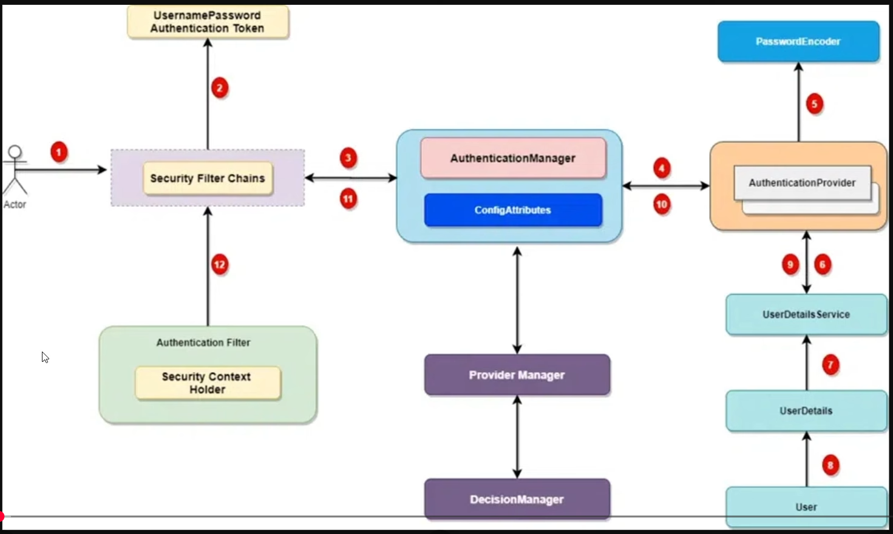

Truy cập Sring oauth2 Résource server xem document

1. JWT là gì? 
    JSON WEB TOKEN
    
    Bài toán gốc: API muốn biết “request này là của ai?” mà không muốn giữ trạng thái trên server.

    Ngày xưa: Session -> Lưu trạng thái RAM/DB
    
    Hiện nay: Thay vì giữ trạng thái đó thì Server sẽ xác thực Client thông qua "Gói thong tin đã được ký "
    
    Gói thông tin:
    
        + Được ký: Nếu sửa thì sẽ phát hiện ra ngay
        + Gói có hạn sử dụng: Hết hạn thì out
    => ĐÓ LÀ JWT 

2. JWT là chuẩn RFC 7519 nhưng nó hay đi kèm 2 khái niệm: 

        2.1 JWS (JSON Web Signature) – JSON được ký → chống sửa
        -> dev backend dùng ngày thường chính là JWS dạng compact.

        2.2 JWE (JSON Web Encryption) – JSON được mã hóa → giấu nội dung
        -> Ít dùng hơn trong mấy tutorial vì phức tạp.
=> Tập trung vào JWT 2.1. => ai cũng đọc được payload nhưng khogno sửa được.

3. Cấu trúc 3 phần của JWT

    HEADER.PAYLOAD.SIGNATURE

    -> 3 phần này đều là chuỗi Base64Url, nối với nhau bằng dấu .

        3.1 Header
            Là thông tin META 

            {
            "alg": "HS256",
            "typ": "JWT"
            }

        alg: thuật toán ký (HS256, RS256, ES256,…)
        typ: thường là "JWT"

        3.2 Payload 
            - Là nội dung muốn nhét vào token. Trong JWT gọi là Claims 
        Có 3 loại claims:
            1. Registered claims (chuẩn gợi ý): iss, sub, aud, exp, nbf, iat, jti
                sub (subject): thường là - username/email/userId
                exp (expiration time): giới hạn tuổi token
                iat (issued at): lúc phát hành
            
            2. Public claims: mở rộng, ai cũng có thể dùng, miễn không đụng tên
            3. Private claims: tự đặt trong hệ thống
                Ví dụ: 
                    {
                       "userId": 12,
                       "fullName": "Nguyễn Văn A",
                       "roles": ["ROLE_ADMIN", "ROLE_USER"],
                       "centerId": 3
                    }

        3.3 Signature
            - Đây là phần để chống sửa.
                Khi client gửi token lại, server chỉ việc:
                    Tự tính lại signature với cùng SECRET_KEY
                    So với signature client gửi
                    Không khớp → token bị sửa → từ chối

1. Ddonsg soi 